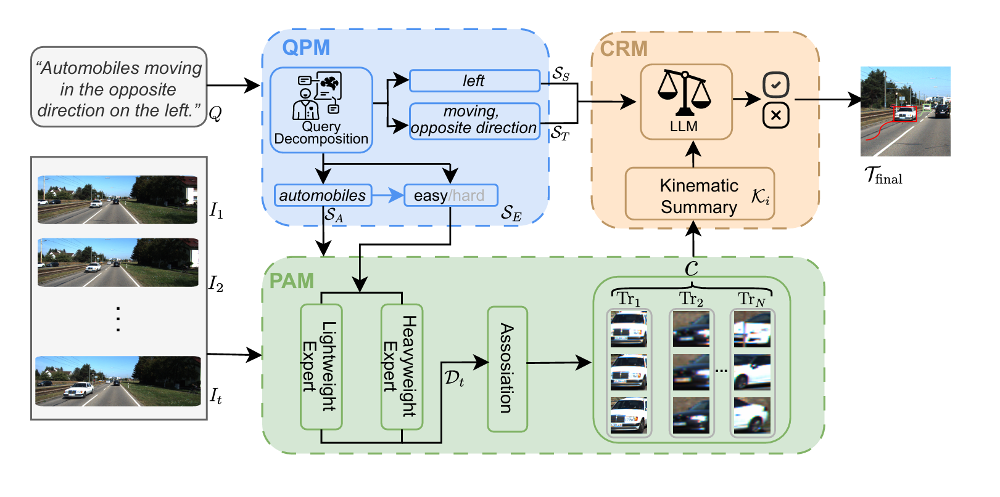

# Cognitive-Inspired Top-Down Framework for Open-World Referring Multi-Object Tracking (PPR-MOT)

[](https://opensource.org/licenses/MIT)

Official implementation of **PPR-MOT**, a training-free, modular framework that reformulates Referring Multi-Object Tracking (RMOT) as a top-down cognitive process. 

This repository accompanies the manuscript submitted to **The Visual Computer**:  
> **Cognitive-Inspired Top-Down Framework for Open-World Referring Multi-Object Tracking**


## Overview
PPR-MOT addresses the limitations of traditional monolithic RMOT methods by introducing a structured cognitive hierarchy. Inspired by human dual-mechanism attention theory, our framework achieves robust **zero-shot generalization** to complex linguistic structures, fine-grained appearances, and new motion patterns without any task-specific fine-tuning.



The framework consists of three coordinated modules:
*   **Query Planning Module (QPM)**: Decomposes natural language queries into structured plans (Appearance, Spatial, and Behavioral semantics) using an LLM.
*   **Perception and Association Module (PAM)**: Grounds candidates by employing dynamically selected open-vocabulary experts and a motion-prior association engine.
*   **Cognitive Reasoning Module (CRM)**: Validates trajectories against behavioral semantics using deterministic **kinematic descriptors**.


## Framework Details

### Query Planning (QPM)
Parses queries into structured JSON constraints. The reasoning templates used to ensure LLM determinism are provided in `config/reasoning_templates.yaml`.

### Perception & Association (PAM)
Generates candidate trajectories. It is compatible with various detection backends (e.g., GroundingDINO, YOLO-World) and trackers (e.g., ByteTrack). Intermediate tracklets are saved under `outputs/intermediate_trajectories/` for inspection.

### Spatio-Temporal Reasoning (CRM)
Evaluates trajectory-query alignment. This module implements the motion reasoning logic described in the manuscript. All motion features are computed deterministically to ensure reproducibility.


## Installation
### Environment
```bash
conda create -n pprmot python=3.8
conda activate pprmot
pip install -r requirements.txt
```

### External Dependencies
Please install the following components following their official instructions:
- [GroundingDINO](https://github.com/IDEA-Research/GroundingDINO)
- [ByteTrack](https://github.com/ifzhang/ByteTrack)

Optional (for open-vocabulary reasoning):
- [Qwen-VL](https://github.com/QwenLM/Qwen-VL) 


## Model Weights
Place required weights under:
`weights/`

Example:
```
weights/
├── groundingdino_swinb_cogcoor.pth
```

For API-based models,  please configure your API credentials in:
`config/settings.yaml`


## Dataset Preparation
### Refer-KITTI
Download the KITTI tracking dataset from the [official website](http://www.cvlibs.net/datasets/kitti/eval_tracking.php).
Create a symbolic link to the images:
```bash
ln -s /path/to/your/KITTI dataset/data/KITTI
```
### Referring Expressions & Labels
Download the labels for Refer-KITTI (v1 & v2) from this [Google Drive folder]( https://drive.google.com/drive/folders/1IpDeFDu9CtrQWyH9Au8K91uk1SbwujWI).

Expected Directory Structure:
```
data/
└── Refer-KITTI/
    ├── images/       # Link to KITTI image_02
    ├── refer-kitti-v1/ # Expressions and labels
    └── refer-kitti-v2/ # Expressions and labels
```

## Running Inference
### Single query evaluation
To execute the tracking pipeline on a video sequence (e.g., sequence 0005):
```bash
python main.py --video_id 0005 --query "the car that slows down and then makes a turn"
```

### Evaluation
To replicate the benchmark results on Refer-KITTI, follow these two steps:

Step 1: Convert results to TrackEval format
This script organizes your predictions into the standard MOTChallenge hierarchy:
```bash
python tools/eval_converter.py
```
Step 2: Run TrackEval
Execute the shell script to calculate HOTA and other metrics:
```bash
bash tools/run_eval.sh
```

## Reproducibility
To ensure transparency:
- All intermediate trajectory candidates are saved.
- All kinematic features are computed deterministically.
- All reasoning policies are stored in configuration files.
- Exact evaluation scripts are provided.

**Note**: If API-based large models are used, minor variations may occur due to model version updates. We recommend fixing model versions for consistent reproduction.


## Extensibility
PPR-MOT is designed as a plug-and-play framework:
- Replace detector → update `modules/perception_association/`
- Replace tracker → update tracking backend
- Replace reasoning policy → modify `config/reasoning_templates.yaml`

No retraining is required.


## Citation
If you find this repository useful, please cite:
```bibtex
@article{zhu2026pprmot,
  title={Cognitive-Inspired Top-Down Framework for Open-World Referring Multi-Object Tracking},
  author={Zhu, Yuhan and Wang, Haoxiang and Zhang, Yutong},
  journal={The Visual Computer},
  year={2026},
  note={Under Review},
  url={https://github.com/Tracy-ZYH/PPR-MOT}
}
```